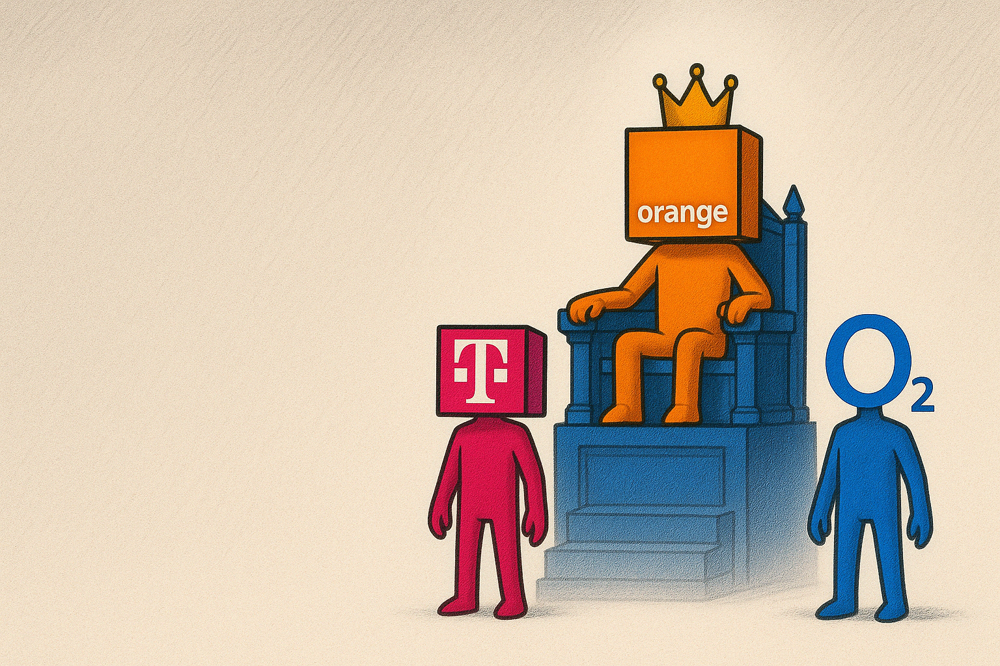

# Orange Interactive CV Application 🍊

 <!-- Optional: Add a banner or logo if you have one -->

Welcome to the interactive CV project! This application presents a dynamic and engaging way to showcase professional experience, featuring an interactive chatbot assistant.

## ✨ Key Features

*   **Interactive CV Display:** Presents resume information in a modern web format (potentially using `CvModal.tsx`).
*   **AI Chatbot Assistant:** Allows users to ask questions about the CV content via an integrated chatbot (`Chatbot.tsx` and `/api/chat`).
*   **Responsive Design:** Built with Tailwind CSS for adaptability across different screen sizes.
*   **Modern Tech Stack:** Leverages Next.js for server-side rendering and a robust frontend framework.

## 🛠️ Tech Stack

*   **Framework:** [Next.js](https://nextjs.org/)
*   **Language:** [TypeScript](https://www.typescriptlang.org/)
*   **Styling:** [Tailwind CSS](https://tailwindcss.com/)
*   **Chat API:** (Likely leveraging Vercel AI SDK or similar based on `src/app/api/chat/route.ts`)

## 🚀 Getting Started

Instructions on how to set up and run this project locally.

### Prerequisites

*   Node.js (v18 or later recommended)
*   npm or yarn

### Installation & Running

1.  Clone the repository:
    ```bash
    git clone https://github.com/ZEDce/interactiveCV.git
    cd interactiveCV
    ```
2.  Install dependencies:
    ```bash
    npm install
    # or
    # yarn install
    ```
3.  Set up environment variables (if any - e.g., for OpenAI API Key). Create a `.env.local` file based on `.env.example` (if one exists).
4.  Run the development server:
    ```bash
    npm run dev
    # or
    # yarn dev
    ```
5.  Open [http://localhost:3000](http://localhost:3000) in your browser.

## 🤝 Contributing

(Optional: Add guidelines if you plan for others to contribute)

## 📄 License

(Optional: Specify a license, e.g., MIT) 